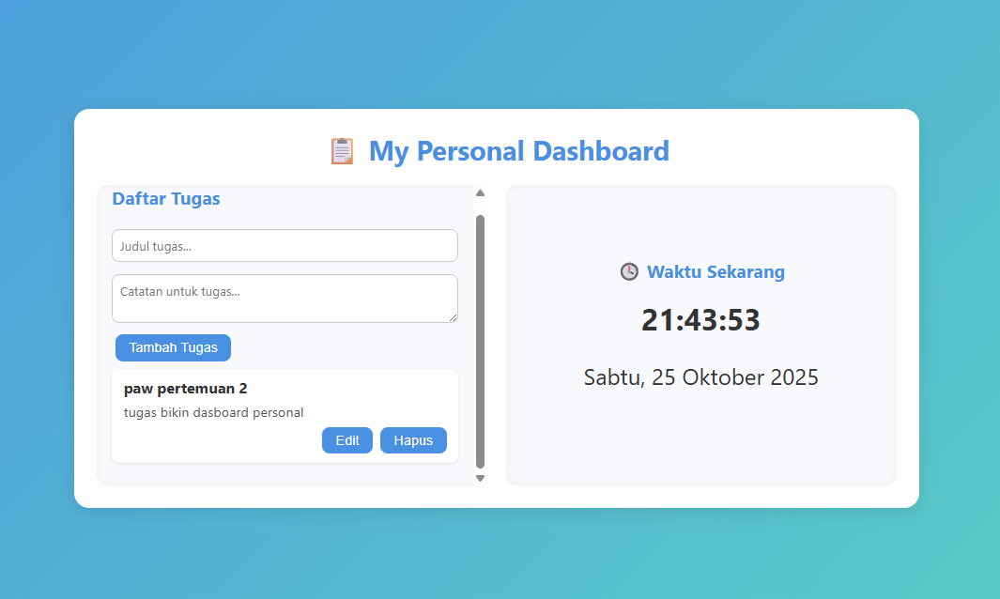

# 🧭 My Personal Dashboard

## 📘 Penjelasan Singkat  
**My Personal Dashboard** adalah aplikasi web sederhana yang membantu pengguna mencatat **daftar tugas beserta catatan pribadi**.  
Aplikasi ini bersifat **interaktif**, memungkinkan pengguna untuk **menambah, mengedit, dan menghapus** data langsung di browser.  
Semua data disimpan secara otomatis di **localStorage**, sehingga tidak akan hilang meskipun halaman di-refresh.

---

## ✨ Fitur-Fitur Aplikasi
1. **Tambah Tugas dan Catatan Pribadi**  
   Pengguna dapat menuliskan nama tugas serta catatan tambahan untuk tiap tugas.
2. **Edit & Hapus Tugas**  
   Setiap tugas bisa diubah atau dihapus kapan saja.
3. **Penyimpanan Lokal Otomatis**  
   Data tersimpan menggunakan `localStorage` agar tetap ada setelah browser ditutup.
4. **Waktu Real-Time (Async)**  
   Aplikasi menampilkan waktu saat ini yang diperbarui otomatis setiap detik menggunakan API waktu dunia.
5. **Antarmuka Satu Layar (Dashboard View)**  
   Semua informasi (tugas, catatan, waktu) tampil dalam satu layar sederhana dan responsif.
6. **Tema Ringan & Rapi**  
   Desain minimalis agar nyaman digunakan.

---

## 🧩 Fitur ES6+ yang Diimplementasikan

| Fitur ES6+ | Implementasi |
|-------------|---------------|
| **let & const** | Digunakan untuk deklarasi variabel agar aman dan tidak tumpang tindih |
| **Arrow Functions (≥3)** | - `renderTasks = () => {}`    - `deleteTask = (index) => {}`   - `editTask = (index) => {}` |
| **Template Literals** | Digunakan untuk membuat elemen HTML dinamis dengan `${}` |
| **Async / Await** | Fungsi `getTime()` mengambil data waktu dari API eksternal |
| **Class** | `class TaskManager` digunakan untuk mengelola data tugas dan penyimpanan lokal |

---

## 🖼️ Screenshot Aplikasi  

**1️⃣ Tampilan Dashboard Utama**  

 

---

## 🧑‍💻 Pengembang
**Nama:** Jordy Anugrah Akbar  
**Proyek:** Praktikum Pemrograman Web — Aplikasi Personal Dashboard  
**Tahun:** 2025
