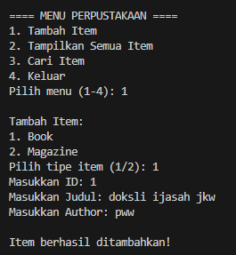
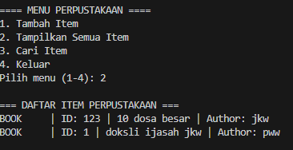
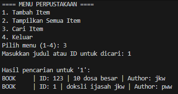

# 📘 Sistem Manajemen Perpustakaan Sederhana (OOP Python)

## 📌 Deskripsi Program
Program ini adalah sistem manajemen perpustakaan sederhana berbasis **Object-Oriented Programming (OOP)**. Pengguna dapat menambahkan item ke perpustakaan, menampilkan seluruh item, dan mencari item berdasarkan judul atau ID.  
Program ini menerapkan konsep:

- **Abstract Class**
- **Inheritance**
- **Encapsulation**
- **Polymorphism**
- **Property Decorator**

---

## 🎯 Fitur Program

### ✔ Menambahkan Item ke Perpustakaan
Pengguna dapat menambahkan 2 jenis item:
- **Book** → ID, Judul, Author  
- **Magazine** → ID, Judul, Issue Number  

### ✔ Menampilkan Semua Item
Menampilkan seluruh koleksi item yang sudah disimpan dalam perpustakaan.

### ✔ Mencari Item Berdasarkan Judul atau ID
Pencarian dapat menggunakan:
- Kata kunci judul, atau  
- ID item secara langsung

---

## 🖼️ Screenshot Hasil Running Program
fitur tambah buku

fitur tampilkan semua

fitur cari

